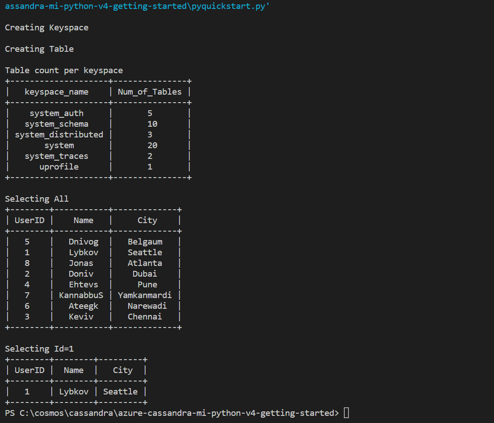

# Accessing Azure Managed Instance for Apache Cassandra using Python
Azure Managed Instance for Apache Cassandra provides automated deployment and scaling operations for managed open-source Apache Cassandra datacenters. It accelerates hybrid scenarios and reduces ongoing maintenance.

This quick start demonstrates how to connect to a Cassandra Managed instance cluster with Python. You'll then build a user profile console app, output as shown in the following image, with sample data.

## Running this sample
* Before you can run this sample, you must have the following perquisites:
	* An Azure Managed Instance for Apache Cassandra cluster. Check out our Quickstart guide [here](https://docs.microsoft.com/azure/managed-instance-apache-cassandra/create-cluster-portal).
    * Networking access from this application to your Azure Managed Instance for Apache Cassandra cluster (the service only deploys private IP addresses injected into a Virtual network).
	* A version of [Python](https://www.python.org/downloads/) that supports the Cassandra driver version. For example, [cassandra-driver==3.20.2](https://pypi.org/project/cassandra-driver/3.20.2/) supports only Python versions 2.7, 3.4, 3.5, 3.6 and 3.7. 
	* [Git](http://git-scm.com/).
    * [Python Driver](https://github.com/datastax/python-driver) - Note: Cassandra driver version 3.20.2 is the latest Python driver that supports the v4 wire protocol for open source Apache Cassandra by default. If using a later version, please explicitly set `protocol_version` to 4 (see sample).

1. Clone this repository using `git clone https://github.com/Azure-Samples/Azure-Samples/azure-cassandra-mi-python-v4-getting-started.git`.

2. Replace `<FILLME>` in `username`, `password`, `contactPoint` and `datacenter-name` with the appropriate values in `config.py`. The `contactPoint` should be one of the private I.P. seed nodes in your cluster.

	```
    'username': '<FILLME>',
    'password': '<FILLME>',
    'contactPoint': '<FILLME>',
    'datacenter-name': '<FILLME>',
    'port':9042
	```

3. Run 
   ```
   pip install cassandra-driver
   pip install prettytable
   pip install requests
   pip install pyopenssl
   ```
   in a terminal to install required python packages
   
4. Run `python pyquickstart.py` in a terminal to execute it.

    

## About the code
The code included in this sample is intended to get you quickly started with a python program that connects to Azure Managed Instance for Apache Cassandra.

